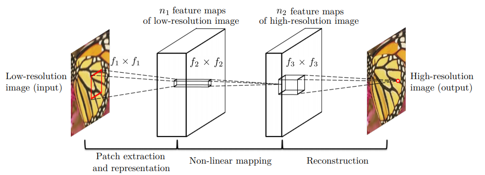
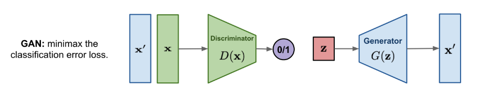
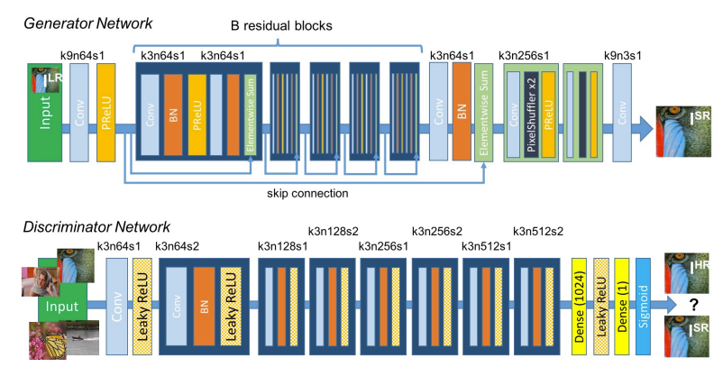
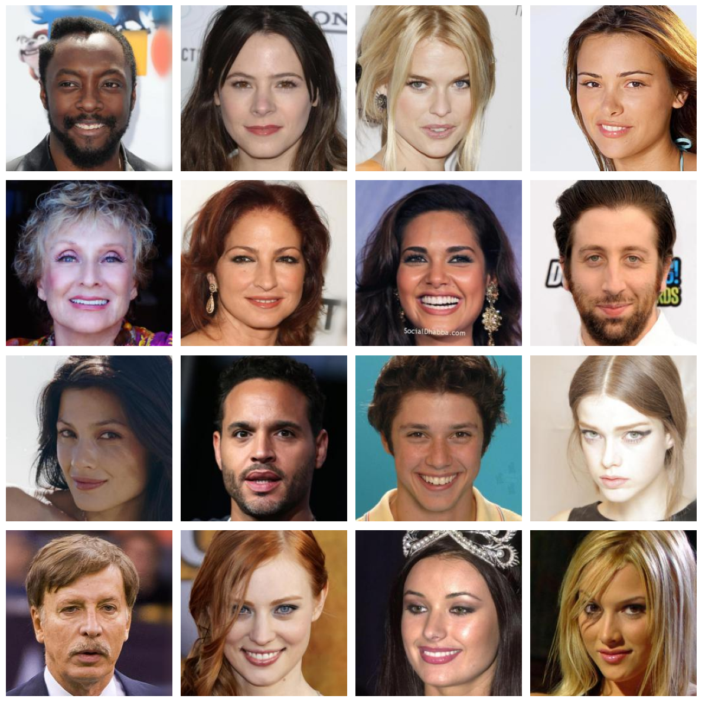
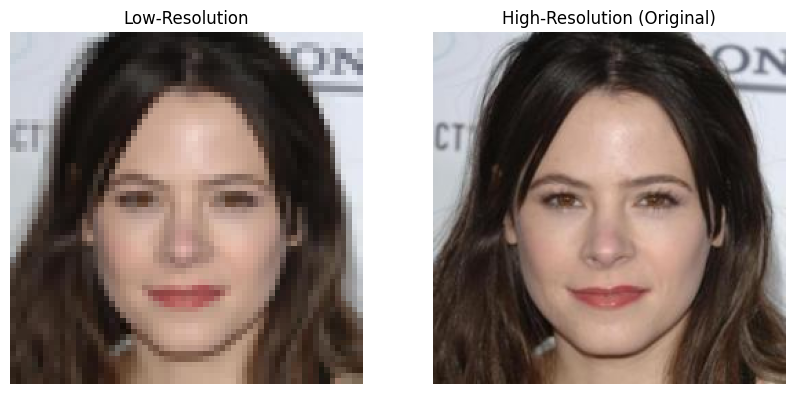
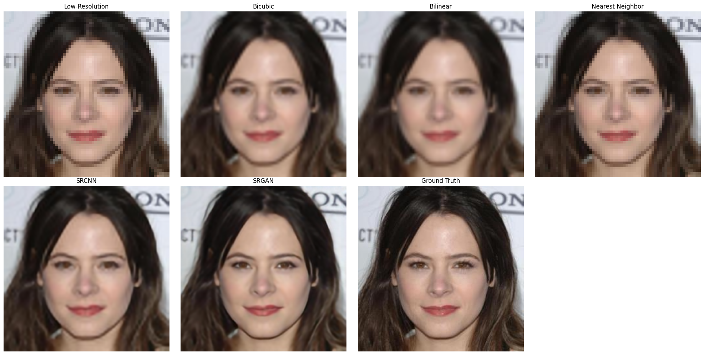

# 🚀 Single Image Super-Resolution (SISR) with Deep Learning

## 📌 Overview
Single Image Super-Resolution (SISR) is a crucial problem in Computer Vision that aims to reconstruct a high-resolution (HR) image from a low-resolution (LR) counterpart. This project implements and compares different Super-Resolution approaches, including:

- **Interpolation-based methods**: Nearest Neighbor, Bilinear, Bicubic
- **Deep Learning models**: SRCNN, SRGAN

---

## 🎯 Objectives
- Implement and evaluate different SISR methods.
- Compare classical interpolation techniques with deep learning models.
- Analyze image quality using **PSNR**, **SSIM**.

---

## 🏗️ Methodology

The project investigates **Super-Resolution CNN (SRCNN)** and **Super-Resolution GAN (SRGAN)**, leveraging deep learning techniques for enhanced image reconstruction.

### 1️⃣ SRCNN (Super-Resolution Convolutional Neural Network)  

**SRCNN** is one of the first deep learning-based super-resolution methods.  

  

  

### 2️⃣ SRGAN (Super-Resolution Generative Adversarial Network)  

**SRGAN** uses adversarial training to generate realistic high-resolution images.  

  

 

  

 

---

## 📂 Dataset

We use [CelebA-HQ](https://www.kaggle.com/datasets/badasstechie/celebahq-resized-256x256), a high-quality dataset of celebrity faces with images at **256×256** resolution.

  

The LR images are generated by downsampling to **64×64** using bicubic interpolation.

  

---

## 🔬 Experiment Setup  

All experiments were conducted on **Kaggle Notebooks** using **NVIDIA Tesla P100 GPU** for training and inference.  

🔗 **Kaggle Notebook Link**: [Click here](https://www.kaggle.com/code/khoatrnminh/single-image-super-resolution)

---

## 📊 Results  

| Method  | PSNR (dB) | SSIM  | Inference Time (s) |  
|---------|:----------:|:-------:|:-------------------:|  
| Nearest Neighbor | 26.72  | 0.777 | 0.0001  |  
| Bilinear | 28.31  | 0.833 | 0.0001  |  
| Bicubic | 28.18  | 0.851 | 0.0001  |  
| SRCNN | 30.40 | 0.872 | 0.0025  |  
| SRGAN | **31.61** | **0.893** | 0.0095  |  

 🖼️ **Visual Comparison**

  

  

🔹 **Key Findings**:  
- **SRGAN outperforms all other methods** in both PSNR and SSIM, producing visually sharper images.  
- **SRCNN achieves a balance between speed and quality**, making it a viable alternative for real-time applications.  
- **Traditional interpolation methods** yield lower-quality results but are computationally efficient.  

--- 

## 📜 References  

- Dong, C., Loy, C., He, K. & Tang, X. *Image Super-Resolution Using Deep Convolutional Networks*. IEEE Transactions on Pattern Analysis and Machine Intelligence, 38(2), 295-307 (2016). [[Paper](https://arxiv.org/abs/1501.00092)]  
- Ledig, C., Theis, L., Huszár, F., Caballero, J., Cunningham, A., Acosta, A., Aitken, A., Tejani, A., Totz, J., Wang, Z. & Shi, W. *Photo-Realistic Single Image Super-Resolution Using a Generative Adversarial Network*. 2017 IEEE Conference on Computer Vision and Pattern Recognition (CVPR), 105-114 (2017). [[Paper](https://arxiv.org/abs/1609.04802)] 

---

## 🙌 Contributors

- [Phan Trần Minh Đạt](https://github.com/datptm2003)  
- [Trần Minh Khoa](https://github.com/KhoaTran235)  

